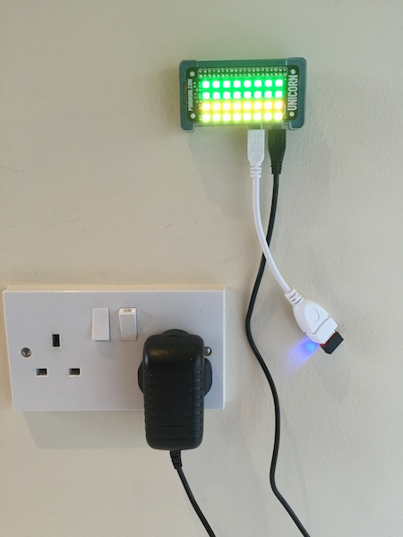

# saucicorn
raspberry pi, unicorn phat and a python script = coloured LEDs indicating Sauce Labs status etc.

 * check if there's internet access
 * verify saucelabs.com is up
 * check status.saucelabs.com for open incidents
 * check how many support tickets I currently have in the 'open' state
 * check how many unassigned support tickets there are in the queues

... and display coloured status lights accordingly (green=good, red=bad, etc.)



demo video: https://www.dropbox.com/s/eb3ok6fbm33bdvb/saucicorn.mov?dl=0

required kit: 

 * raspberry pi zero (or a standard pi of some sort) 
 * micro SD card with raspbian jessie
 * unicorn phat (or unicorn hat)
 * usb wifi dongle
 * usb power supply
 
First of all, get your pi and unicorn (p)hat soldered/attached, raspbian jessie installed on a micro SD card and make sure the pi runs (easiest to start with it connected to a screen with keyboard/mouse). Setup wifi, install unicorn (p)hat library and examples (https://github.com/pimoroni/unicorn-hat) and test.

Clone and edit saucicorn.py - you'll need to specify your own saucelabs desk username/email and password and check the Desk REST API filters work for you, particularly the 'my open tickets' filter. If you're logged into https://support.saucelabs.com, you can request https://support.saucelabs.com/api/v2/filters in a browser to see all the filters which are available to you.

Run the script with sudo (as the unicorn (p)hat uses the Raspberry Pi's GPIO pins, all of these examples must be run with sudo):

```
sudo python saucicorn.py
```

To have this launch on startup, do something along the lines of http://www.instructables.com/id/Raspberry-Pi-Launch-Python-script-on-startup/?ALLSTEPS - mine (will add in this repo at some stage) runs on startup and every 5 minutes and the launcher bash script kills any existing matching processe before starting again.

